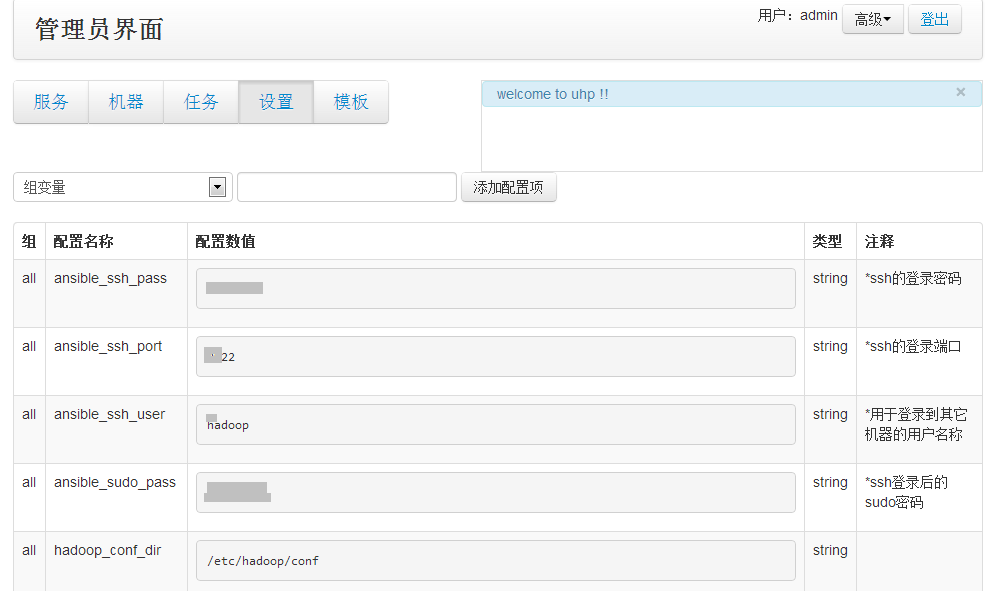
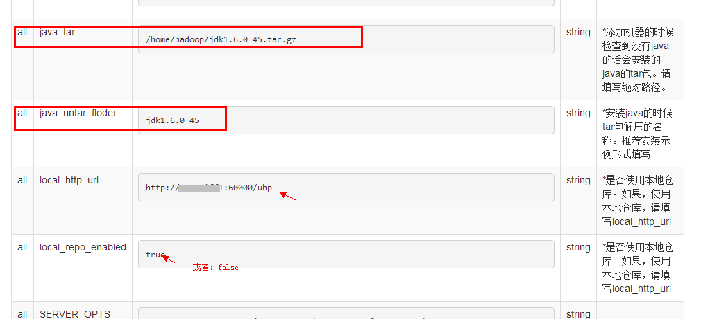
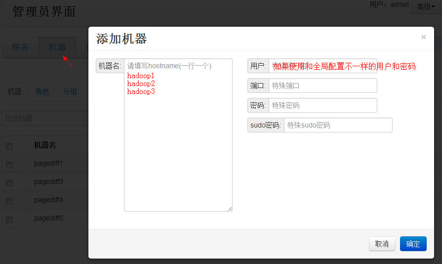
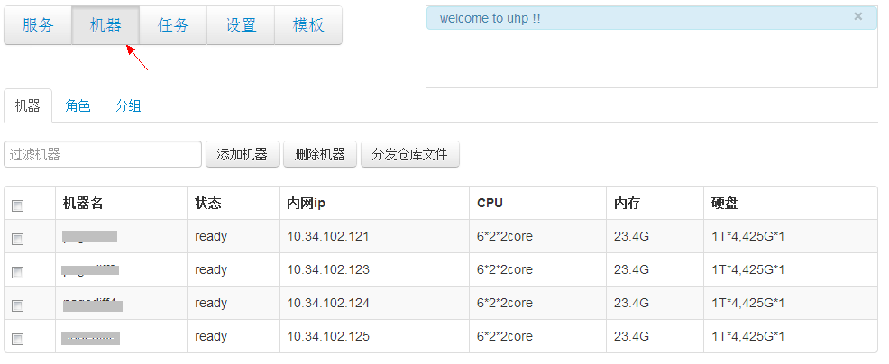
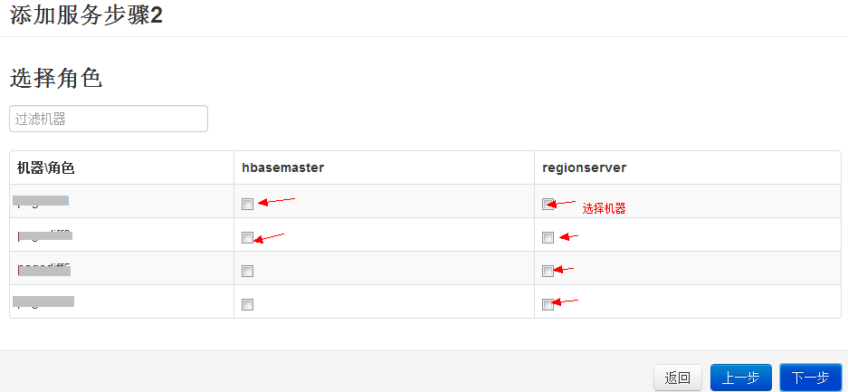
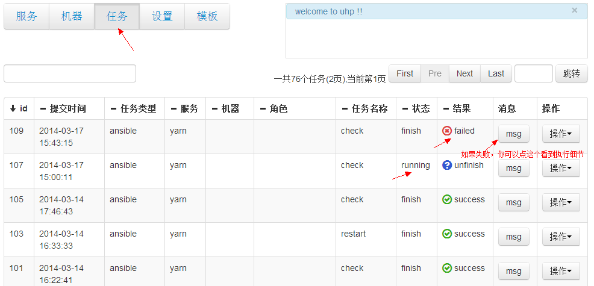
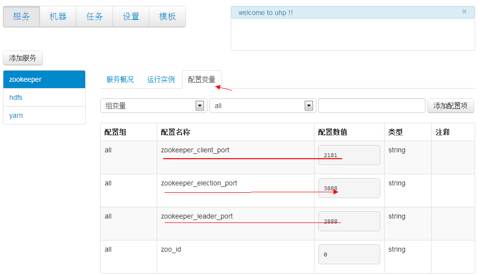
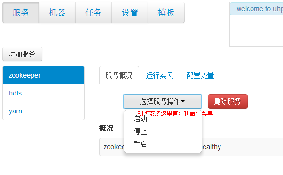
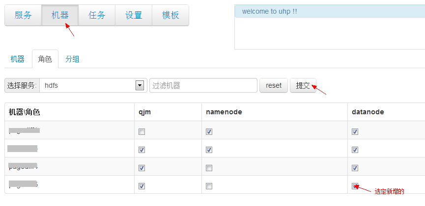

uc-hadoop-platform
==================

##UHP是什么？

UHP是UC Hadoop Platfrom的缩写，是公司内部共用的Hadoop基础平台。

为什么需要UHP?
1. 节约硬件成本：建设一个Hadoop集群需要较多的硬件成本，中小业务单独建设集群不现实。
2. 节约运维成本：Hadoop需要专业的工程师运维，学习成本高，运维难度大。
3. 数据共享：集群间的数据共享非常麻烦，多业务共用集群有利于数据共享。

UHP的目标：
1.  实现多租户接入，完善底层鉴权和权限，让数据共享更灵活更安全。
2.  降低运维成本，让Hadoop平台运维自动化，安装部署监控一体化。
3.  提供基本的大数据处理工具（作业调度、Hive查询、Impala查询）。

## UHP的一些特性

*   UHP是主要以Python写作的应用软件，通过Web服务和Daemon程序管控Hadoop。
*   UHP部署在单台机器上，UHP不需要和Hadoop主机部署在相同机器上，但习惯上是部署在一起的。
*   UHP和Hadoop没有强的依赖关系，UHP程序崩溃不会影响Hadoop运行。
*   UHP期望是无单点故障的，它的主要数据存储在Mysql中，所以强烈建议Mysql部署成主主互备。  
    如果UHP所在机器故障，在另一个机器Git代码，连上原有数据库，启动即可继续服务。
*   UHP使用Ansible脚本执行任务，使用Yum安装Cloudera的CDH。
*   UHP安装在单一用户下，要求此用户有sudo权限。

### 基本要求

*   操作系统
    *   UHP安装机器：CentOS 6+，Python 2.6+
    *   其它机器：CentOS 5.4+，Python 2.4+
*   数据库
    *   Mysql 4+，需要事先安装，最好主主互备
*   用户
    *   需要有sudo权限 
*   Yum源
    
    yum必须能正常使用，至少需要2个源：CentOS，epel

*注:依赖Bash*

## 安装

*以下操作需要*root*用户。*

1.  用户创建

    以*hadoop*用户为例
    
        adduser hadoop
        passwd hadoop
        \# 输入2次密码

        \# 添加sudo用户
        visudo
        \# 在打开的文件中添加
        hadoop  ALL=(ALL)   ALL
        
    *注意：需要在所有要安装Hadoop的机器上创建*

2.  host创建

    *   虽然不是必须的，但是为了管理上的方便，强烈建议使用host。
    *   建议host简单易记，例如`hadoop1, hadoop2, node1, node2`之类。

    使用host有个问题，就是有些机器上不止一个host，这会带来一些麻烦，尽量保持所有机器上的host单一、一致。
    *注意：需要在所有要安装Hadoop的机器上创建*

3.  mysql准备

        yum install mysql mysql-server -y
        /etc/init.d/mysqld start
        mysql
        mysql> create database uhp character set utf8;
        mysql> grant all privileges on uhp.* to 'uhp'@'%' identified by 'uhp' with grant option;
        mysql> grant all privileges on uhp.* to 'uhp'@'localhost' identified by 'uhp' with grant option;

*以下操作需要*hadoop*用户。*

1.  下载代码

    建议的安装目录为`$HOME/local`，所以：

        mkdir -p $HOME/local

    1.  Git方式
       
            cd $HOME/local
            git clone https://github.com/uhp/uhp.git

    2.  Tar包下载

            mkdir -p $HOME/download
            cd $HOME/download
            # github.com上下载，注意版本
            wget https://github.com/uhp/uhp/archive/master.zip
            unzip uhp-master.zip -d $HOME/local
            cd $HOME/local
            mv uhp-master uhp

2.  设置环境变量 
   
    在`$HOME/.bash_profile`中：
    
    1.  `export UHP_HOME=$HOME/local/uhp`
    2.  `export ANSIBLE_CONFIG=$HUP_HOME/conf/ansible.cfg`
	
    *设置后请重新登录或者`source ~/.bash_profile`，使配置生效*
    *请不要随意更改根目录,否则可能会导致不可用*
	
3.  依赖初始化

    初次启动请运行`cd $UHP_HOME; sh bin/init.sh`安装依赖，同时会创建一系列的运行目录等。
    由于环境的不同，这里有可能异常，请整理自己的机器环境，使此脚本运行通过。

5.  安装本地库(可选)

    *如果你不熟悉以下操作，可以跳过*
	UHP选用CDH的Yum安装作为底层。安装过程中会需要连接CDH官网下载JAR包。
	由于众所周知的原因，可能会导致连接CDH官方的网站缓慢。
	而且大批量地安装连接CDH官网也会导致带宽吃紧。
	安装本地库，可以极大地减轻带宽压力。
	
	安装:
	1.  准备一个所有机器都能访问的HTTP服务。
	2.  运行以下命令开始安装本地库:
		
		        sudo sh bin/createrepo.sh /xx/xx/xx 5 

		(第一个参数请正确填写要下载的本地目录,第二个参数填写下载centos5或者centos6的仓库。
		如果，集群中既有centos5的系统和centos6的系统,请下载这两个仓库)
	
	3. 在你指定的下载目录会发现下载好的文件,格式为格式如下：
	
		└── 5
			└── cloudera-cdh4
				└── cloudera-cdh4
					└── RPMS
						├── noarch
		...
		
		将这个文件夹移动到你的HTTP的root目录，然后尝试通过浏览器访问，看能不能访问到相关目录。
		如果可以，那本地仓库就安装成功了。
	
	如果,网络状况太差，下载失败。可以使用我们准备好的[uhp_repo.tar.gz](http://pan.baidu.com/share/link?shareid=3415691721&uk=486905787)包，直接在HTTP服务的本地根目录解压即可。

6.  启动uhp界面
    
    1.  创建配置文件
    	
    		cp uhpcommon/config.template.py uhpcommon/config.py

    1.  数据库初始化
        
        修改*uhpcommon/config.py*中的*connection*选项使之能正确地连接MySql，运行以下命令，进行初始化：
	    
            python uhpcommon/database.py
        
        可以修改文件中User表的数据，配置需要的用户名和密码，默认用户密码是：admin:admin
    	
    2.  启动服务

            sh ./bin/start-uhp.sh

    5.  访问*http://xxxx:59990*即可

## 安装服务

### 基本设置 

访问uhpweb的网址 用户名初始密码: admin/admin  
**非常重要：初次访问请设置必要的全局变量**  
路径(管理员界面-设置)，修改以下关键变量:
1.  用户和密码

        ansible_ssh_user: 用于登录到其它机器的用户名称
        ansible_ssh_port: ssh的登录端口
        ansible_ssh_pass: ssh的登录密码
        ansible_sudo_pass: ssh登录后的sudo密码
    
    

1.  用户自己同的JDK
		
        java_tar: 添加机器的时候.检查到没有java的话会安装的java的tar包。请填写绝对路径。
        java_untar_floder: 安装java的时候tar包解压的名称。推荐安装示例形式填写
    
    

1.  如果选择使用本地仓库，配置它
		
        local_repo_enabled:*是否使用本地仓库。如果，使用本地仓库，请填写local_http_url
        local_http_url:*如果使用本地仓库，本地仓库的地址

### 添加机器

    
    

    如果看到机器的状态变为"ready"，就成功了。

### 添加服务

1.  添加服务

    
    
    

    之后你会在"任务"标签先看到添加服务的Task。
    

2.  修改服务中的配置

    

3.  初始化、启动服务

    

### 为服务增加新机器

### 各个模块说明

1.  服务：管理和安装各种服务。
	
2.  机器: 管理各个机器。

3.  任务：查看所有运行的任务。
	
4.  设置：配置一些全局配置。
	
5.  模板：修改服务配置文件的模板。（主要用来对不同机器使用不同配置）
	
6.  右上角-高级-手动修改：针对一些意外发生的bug，可以方便地修改一些数据库的状态。

